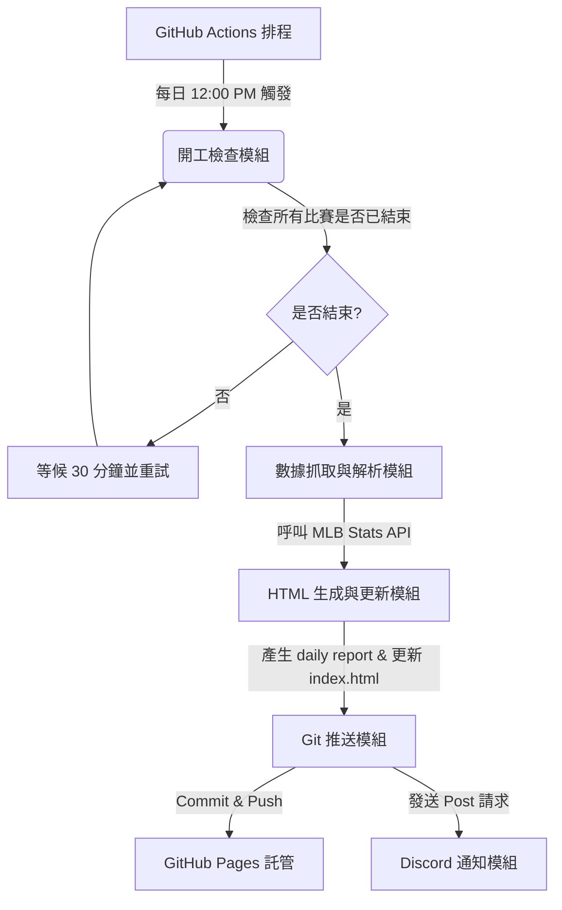

# MLB Daily Scores Report (MLB 每日戰報)

[](https://haolun588.github.io/MLB-daily/)

一個輕量化、無伺服器 (Serverless) 運行的自動化 MLB 戰報生成系統。本專案透過 GitHub Actions 每日定時執行 Python 腳本抓取 MLB 官方數據，自動生成現代深色模式 (Modern Dark Mode) 的響應式網頁，並藉由 GitHub Pages 進行託管，最後透過 Discord Webhook 即時推送通知與瀏覽連結。

---

## ⚙️ 系統工作流程 (Workflow)



1. **定時觸發**：每日台北時間中午 12:00 (12:00 PM) 由 GitHub Actions 排程啟動。
2. **狀態檢查與等待機制**：
   - 腳本會先查詢昨日所有賽事的狀態（是否皆為 `Final` 或 `Postponed`）。
   - 若有任何比賽尚未結束，則自動休眠 30 分鐘後重新檢查，確保數據完整才開始解析。
3. **數據抓取與處理**：呼叫 MLB Stats API，解析昨日賽事的關鍵數據。
4. **靜態網頁生成**：套用 HTML 模板輸出每日獨立戰報網頁，並自動更新首頁的歷史戰報索引。
5. **自動部署與通知**：將產生的網頁 Commit & Push 回 Repo，觸發 GitHub Pages 部署，隨後向 Discord Webhook 發送精美的戰報通知與網頁連結。

---

## ✨ 核心特色與設計細節

### 1. 傑出表現球員篩選機制 (Top Performers Selection)
系統會對每場比賽兩隊的所有上場球員進行表現積分計算，並不分勝負隊伍，選出表現最優異的球員：
*   **打者積分公式**：
    $$\text{Score} = H \times 1 + 2B \times 2 + 3B \times 3 + HR \times 4 + RBI \times 1.5 + R \times 1 + SB \times 1 + BB \times 1$$
    *   *傑出門檻*：積分 $\ge 7.0$ 分 (例如 2 安打、1 全壘打、2 打點，或 3 安打、1 盜壘、2 得分等)。
*   **投手積分公式**：
    $$\text{Score} = IP \times 3 + K \times 1 - ER \times 2 - H \times 1 - BB \times 1 + (\text{Win} ? 5 : 0) + (\text{Save} ? 4 : 0)$$
    *   *傑出門檻*：先發投手 (SP) $\ge 15.0$ 分；後援/救援投手 (RP/SU/CL) $\ge 8.0$ 分。
*   **錄取邏輯**：每場比賽不分隊伍自動排序，**前 3 名保證錄取**。第 4 名（含）起，只要積分達上述傑出門檻即自動額外加列，無名額上限。

### 2. 精美響應式網頁設計 (Responsive Dark Mode)
*   **上下分層佈局 (方案 B)**：
    *   **上半部**：滿版寬度對戰組合、R-H-E 記分板與賽況標籤。
    *   **下半部**：分割雙欄，左欄為「投手決定（勝/敗/救援）」，右欄為「單場傑出表現球員」。有效避免排版因球員名單過長而拉伸或留白。
*   **SVG 官方隊徽優化**：引入 MLB 官方 `team-cap-on-dark` SVG 隊徽，在 CSS 中加入 `filter: drop-shadow(0 0 2px rgba(255,255,255,0.65))` 外發光效果，解決暗色隊徽在深色背景下對比度不足的問題。
*   **平滑動畫**：懸停時隊徽與卡片會產生縮放與陰影漸變的微動畫，增強互動質感。

### 3. 進階長期維護機制
*   **歷史戰報分層存檔**：當累計報告變多時，腳本自動按年/月分層儲存（`reports/YYYY/MM/YYYY-MM-DD.html`），並在首頁使用輕量 `archive_index.json` 進行動態 JavaScript 渲染。
*   **無賽事/休賽季自動跳過**：若昨日無任何大聯盟賽事（例如明星賽、休賽期等），系統會自動偵測並靜默結束，不生成空白報告，亦不發送 Discord 空白通知，實現全自動零干預維護。

---

## 📊 數據呈現規格

### 1. 打者數據 (Batters)
*   **基礎數據**：打數 (AB)、得分 (R)、安打 (H)、打點 (RBI)、保送 (BB)、被三振 (SO)。
*   **長打與盜壘**：二壘安打 (2B)、三壘安打 (3B)、全壘打 (HR)、盜壘 (SB)。
*   **賽季累計標記**：標記該長打/盜壘在「該場比賽的次數」以及「該次數對應的賽季累計總數」。
    *   *格式範例*：`HR: 1(9)` 表示該場比賽有 1 支全壘打，且為個人賽季第 9 轟。
    *   *複數範例*：`HR: 2(10)(11)` 表示該場比賽有 2 支全壘打，分別為個人賽季第 10 與 11 轟。
    *   *盜壘範例*：`SB: 1(15)` 表示該場比賽有 1 次盜壘成功，且為個人賽季第 15 次盜壘。

### 2. 投手數據 (Pitchers)
*   專注於當場比賽投球內容：投球局數 (IP)、被安打 (H)、失分 (R)、自責分 (ER)、保送 (BB)、三振 (SO)、總投球數/好球數 (Pitches/Strikes)。

---

## 📁 目錄結構

*   [.agents/AGENTS.md](file:///c:/GitHub/MLB-daily/.agents/AGENTS.md)：AI Agent 工作區規則約束。
*   [docs/architecture.md](file:///c:/GitHub/MLB-daily/docs/architecture.md)：專案架構說明文件。
*   [docs/dev_rules.md](file:///c:/GitHub/MLB-daily/docs/dev_rules.md)：開發守則與細部規格。
*   [docs/progress.md](file:///c:/GitHub/MLB-daily/docs/progress.md)：專案開發進度表。
*   [docs/dev_logs/](file:///c:/GitHub/MLB-daily/docs/dev_logs/)：開發日誌目錄。
*   [templates/report_template.html](file:///c:/GitHub/MLB-daily/templates/report_template.html)：每日戰報網頁 HTML 模板。
*   [index.html](file:///c:/GitHub/MLB-daily/index.html)：專案首頁暨歷史戰報索引。
*   [fetch_mlb.py](file:///c:/GitHub/MLB-daily/fetch_mlb.py)：核心 Python 抓取與 HTML 生成腳本。
*   [README.md](file:///c:/GitHub/MLB-daily/README.md)：本說明文件。

---

## 🚀 本地運行指南

### 1. 環境需求
*   Python 3.x
*   無須安裝任何第三方套件（全採用 Python 標準函式庫 `urllib.request` 與 `json` 等，確保環境輕量乾淨）。

### 2. 執行指令
在專案根目錄下執行：

*   **抓取昨日戰報 (預設)**：
    ```bash
    python fetch_mlb.py
    ```
*   **指定日期抓取**：
    ```bash
    python fetch_mlb.py --date 2026-07-20
    ```
*   **啟用完賽檢查與等待機制 (適合排程執行)**：
    ```bash
    python fetch_mlb.py --check-wait
    ```

### 3. Discord Webhook 設定 (選用)
若要啟用 Discord 即時推送功能，請在執行環境設定 `DISCORD_WEBHOOK_URL` 環境變數：
```bash
# Windows (PowerShell)
$env:DISCORD_WEBHOOK_URL="你的Discord_Webhook_網址"

# Linux / macOS
export DISCORD_WEBHOOK_URL="你的Discord_Webhook_網址"
```

---

## 🛠️ 開發守則
本專案開發過程嚴格落實「先規劃、後實作」、「UI 優先」與「模組化循序漸進」原則。詳細說明請見 [開發守則 (dev_rules.md)](file:///c:/GitHub/MLB-daily/docs/dev_rules.md)。