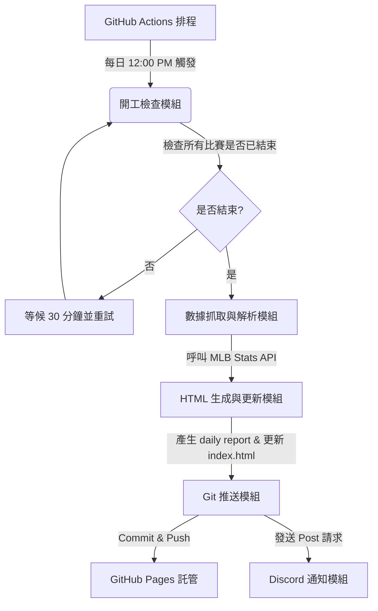

# MLB Daily Scores Report (MLB 每日戰報)

一個輕量化、無伺服器 (Serverless) 運行的自動化 MLB 戰報生成系統。本專案透過 GitHub Actions 每日定時執行 Python 腳本抓取 MLB 官方數據，自動生成現代深色模式 (Modern Dark Mode) 的響應式網頁，並藉由 GitHub Pages 進行託管，最後透過 Discord Webhook 即時推送通知與瀏覽連結。

---

## ⚙️ 系統工作流程 (Workflow)

1. **定時觸發**：每日台北時間中午 12:00 (12:00 PM) 由 GitHub Actions 排程啟動。
2. **狀態檢查與等待機制**：
   - 腳本會先查詢昨日所有賽事的狀態（是否皆為 `Final` 或 `Postponed`）。
   - 若有任何比賽尚未結束，則自動休眠 30 分鐘後重新檢查，確保數據完整才開始解析。
3. **數據抓取與處理**：呼叫 MLB Stats API，解析昨日賽事的關鍵數據。
4. **靜態網頁生成**：套用 HTML 模板輸出每日獨立戰報網頁，並自動更新首頁的歷史戰報索引。
5. **自動部署與通知**：將產生的網頁 Commit & Push 回 Repo，觸發 GitHub Pages 部署，隨後向 Discord Webhook 發送精美的戰報通知與網頁連結。

---

## 📊 數據呈現規格

戰報將著重於呈現每場比賽的關鍵球員數據：

### 1. 打者數據 (Batters)
*   **基礎數據**：打數 (AB)、得分 (R)、安打 (H)、打點 (RBI)、保送 (BB)、被三振 (SO)。
*   **長打與盜壘**：二壘安打 (2B)、三壘安打 (3B)、全壘打 (HR)、盜壘 (SB)。
*   **賽季累計標記**：標記該長打/盜壘在「該場比賽的次數」以及「該次數對應的賽季累計總數」。
    *   *格式範例*：`HR: 1(9)` 表示該場比賽有 1 支全壘打，且為個人賽季第 9 轟。
    *   *複數範例*：`HR: 2(10)(11)` 表示該場比賽有 2 支全壘打，分別為個人賽季第 10 與 11 轟。
    *   *盜壘範例*：`SB: 1(15)` 表示該場比賽有 1 次盜壘成功，且為個人賽季第 15 次盜壘。

### 2. 投手數據 (Pitchers)
*   專注於當場比賽投球內容：投球局數 (IP)、被安打 (H)、失分 (R)、自責分 (ER)、保送 (BB)、三振 (SO)、總投球數/好球數 (Pitches/Strikes)。

---

## 📁 目錄結構

*   [.agents/AGENTS.md](file:///c:/GitHub/MLB-daily/.agents/AGENTS.md)：AI Agent 工作區規則約束。
*   [docs/architecture.md](file:///c:/GitHub/MLB-daily/docs/architecture.md)：專案架構說明文件。
*   [docs/dev_rules.md](file:///c:/GitHub/MLB-daily/docs/dev_rules.md)：開發守則與細部規格。
*   [docs/progress.md](file:///c:/GitHub/MLB-daily/docs/progress.md)：專案開發進度表。
*   [docs/dev_logs/](file:///c:/GitHub/MLB-daily/docs/dev_logs/)：開發日誌目錄 (記錄每次收工變更)。
*   `templates/report_template.html`：每日戰報網頁 HTML 模板 (待開發)。
*   `index.html`：專案首頁暨歷史戰報索引 (待開發)。
*   [README.md](file:///c:/GitHub/MLB-daily/README.md)：本說明文件。

---

## 🛠️ 開發守則與進度

本專案由 AI Agent 協助開發，並嚴格遵循以下原則：
*   **模組化開發**：一次只進行一個功能的開發與驗證，確保程式品質。
*   **UI 優先**：先完成靜態網頁（階段二）的視覺與響應式排版，經人工審查滿意後，才進入 Python 數據串接（階段三）。

詳細的開發限制與進度請參閱：
*   [開發守則 (dev_rules.md)](file:///c:/GitHub/MLB-daily/docs/dev_rules.md)
*   [專案進度表 (progress.md)](file:///c:/GitHub/MLB-daily/docs/progress.md)