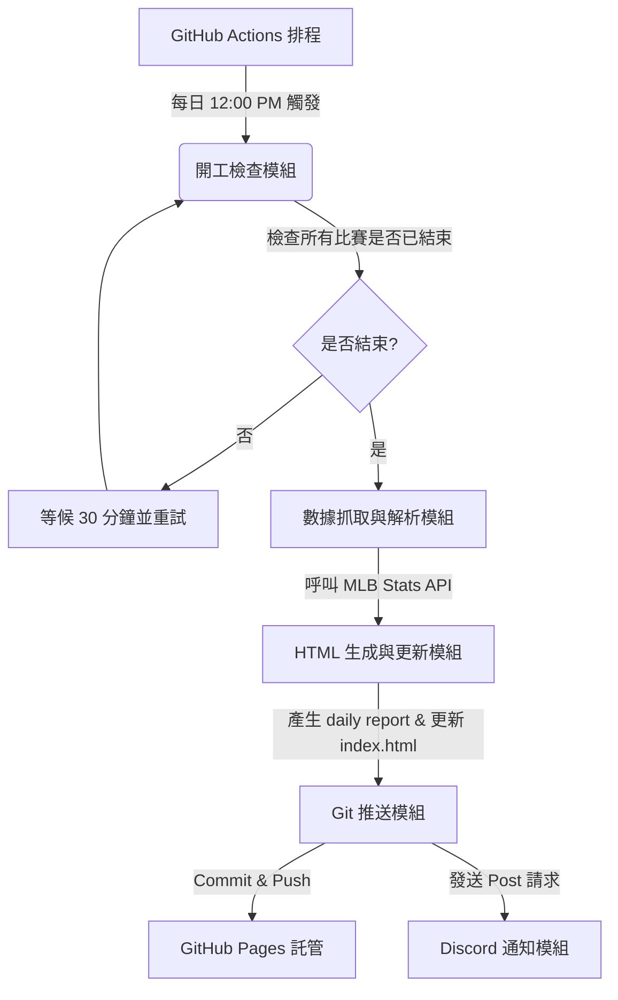

# 專案架構 (Project Architecture)

本專案是一個輕量化的自動化 MLB 戰報生成系統。核心理念是「無伺服器 (Serverless) 運行，靜態網頁託管」，透過 GitHub Actions 每日定時執行 Python 腳本抓取資料，生成靜態 HTML 網頁並藉由 GitHub Pages 提供線上瀏覽，最後透過 Discord Webhook 傳送通知。

---

## 模組劃分 (Modules)

專案主要分為以下四個模組：

### 1. 開工檢查與數據抓取模組 (`fetch_mlb.py`)
- **API 來源**：MLB Stats API (`https://statsapi.mlb.com/api/v1/schedule`)。
- **開工檢查**：每日台北時間 12:00 PM 執行時，腳本會先查詢昨日所有比賽的 `abstractGameState` 是否皆為 `Final` 或 `Postponed`。若有任何比賽仍處於 `Live` / `Pre-Game` / `Warmup`，則腳本進入休眠（30 分鐘後重新檢查），直到確認全部結束。
- **資料解析**：抓取勝負隊伍名稱、最終比分與 R/H/E 數據（不抓取逐局 Linescore 數據）、勝投、敗投及救援投手資訊，並篩選雙方投打的表現焦點（Highlights）。

### 2. HTML 報表生成模組 (`fetch_mlb.py` + `templates/`)
- **日戰報模板**：將解析後的數據填入 `templates/report_template.html`，輸出為 `reports/YYYY-MM-DD.html`。
- **入口索引更新**：自動解析 `reports/` 下已有的檔案，更新 `index.html` 的報告清單與最新賽況概覽。
- **設計風格**：
  - 現代深色模式 (Modern Dark Mode)。
  - 純 CSS 響應式佈局 (Mobile-Friendly)。
  - 專注於即時重點：移除逐局數據，以卡片形式直接呈現最終得分與關鍵表現球員。
  - 利用微動畫與柔和漸層提升視覺體驗。

### 3. Git 推送與託管模組 (GitHub Actions + GitHub Pages)
- **環境**：GitHub Actions Runner。
- **功能**：自動配置 Git 使用者身分，執行 `git add .`、`git commit` 並 `git push` 回 Repo 的 `main` 分支。
- **託管**：利用 GitHub Pages 免費靜態託管服務，對外提供 `https://haolun588.github.io/MLB-daily/` 網頁連結。

### 4. Discord 通知模組
- **機制**：在網頁成功 push 至 GitHub 後，向 Discord Webhook URL 發送 JSON Payload。
- **內容**：包含昨日日期、比賽場數概況、以及剛產生的 GitHub Pages 網頁連結，讓您在手機或電腦點擊即可直接於瀏覽器瀏覽。

---

## 資料流說明 (Data Flow)

1. **觸發時間**：每日 UTC 04:00 (台北時間 12:00 PM)。
2. **比賽檢查**：
   - 查詢 API 賽事狀態。
   - 若未完賽 $\rightarrow$ 等待 30 分鐘 $\rightarrow$ 再次查詢。
   - 若已完賽 $\rightarrow$ 進入資料處理。
3. **網頁生成**：產出 `reports/YYYY-MM-DD.html` 並更新 `index.html`。
4. **Git 自動提交**：推送變更，觸發 Pages 部署。
5. **發送 Discord 訊息**：傳送包含 Pages URL 的精美 Embed 訊息。
