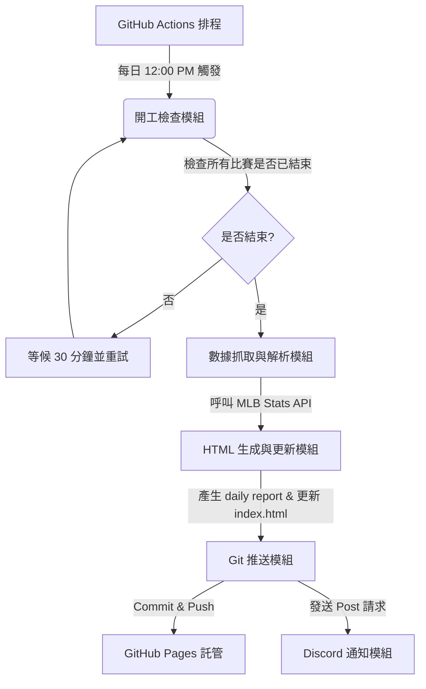

# 專案架構 (Project Architecture)

本專案是一個輕量化的自動化 MLB 戰報生成系統。核心理念是「無伺服器 (Serverless) 運行，靜態網頁託管」，透過 GitHub Actions 每日定時執行 Python 腳本抓取資料，生成靜態 HTML 網頁並藉由 GitHub Pages 提供線上瀏覽，最後透過 Discord Webhook 傳送通知。

---

## 模組劃分 (Modules)

專案主要分為以下四個模組：



### 1. 開工檢查與數據抓取模組 (`fetch_mlb.py`)
- **API 來源**：MLB Stats API (`https://statsapi.mlb.com/api/v1/schedule`)。
- **開工檢查**：每日台北時間 12:00 PM 執行時，腳本會先查詢昨日所有比賽的 `abstractGameState` 是否皆為 `Final` 或 `Postponed`。若有任何比賽仍處於 `Live` / `Pre-Game` / `Warmup`，則腳本進入休眠（30 分鐘後重新檢查），直到確認全部結束。
- **資料解析**：抓取勝負隊伍名稱、最終比分與 R/H/E 數據（不抓取逐局 Linescore 數據）、勝投、敗投及救援投手資訊，並篩選雙方投打的表現焦點（Highlights）。

### 2. HTML 報表生成模組 (`fetch_mlb.py` + `templates/`)
- **日戰報模板**：將解析後的數據填入 `templates/report_template.html`，輸出為 `reports/YYYY-MM-DD.html`。
- **入口索引更新**：自動解析 `reports/` 下已有的檔案，更新 `index.html` 的報告清單與最新賽況概覽。
- **設計風格**：
  - 現代深色模式 (Modern Dark Mode)。
  - 純 CSS 響應式佈局 (Mobile-Friendly)。
  - 採用 **方案 B 上下分層佈局**：
    - **上半部（滿版寬度）**：展示對戰組合、R-H-E 記分板與賽事狀態 badge。
    - **下半部（分割雙欄）**：左欄展示「投手決定（勝/敗/救援）」，右欄展示「單場傑出表現球員」。
    - 這能完美避免因右側球員名單過長而導致左側比分區塊拉伸或產生過多視覺空白。
  - 利用微動畫與柔和漸層提升視覺體驗。


### 3. Git 推送與託管模組 (GitHub Actions + GitHub Pages)
- **環境**：GitHub Actions Runner。
- **功能**：自動配置 Git 使用者身分，執行 `git add .`、`git commit` 並 `git push` 回 Repo 的 `main` 分支。
- **託管**：利用 GitHub Pages 免費靜態託管服務，對外提供 `https://haolun588.github.io/MLB-daily/` 網頁連結。

### 4. Discord 通知模組
- **機制**：在網頁成功 push 至 GitHub 後，向 Discord Webhook URL 發送 JSON Payload。
- **內容**：包含昨日日期、比賽場數概況、以及剛產生的 GitHub Pages 網頁連結，讓您在手機或電腦點擊即可直接於瀏覽器瀏覽。

---

## 🌟 傑出表現球員篩選邏輯 (Top Performers Selection)

為了公平且客觀地列出單場表現優異的球員（不論勝負隊伍），系統將採用以下雙軌篩選機制：

### 1. 篩選機制流程
1. **計算所有球員積分**：針對該場比賽兩隊所有上場的打者與投手，依據其個人數據計算「表現積分」。
2. **基本排序保障**：將所有球員按積分從高到低排序，**不分隊伍，直接錄取前 3 名**。
3. **門檻動態擴充**：自第 4 名（含）以下的球員開始，只要其積分**達到或超過傑出表現門檻**，即自動加列入名單中，無名額上限。

### 2. 積分與門檻定義

#### ⚾ 打者 (Hitters)
* **積分公式**：
  $$\text{Score} = H \times 1 + 2B \times 2 + 3B \times 3 + HR \times 4 + RBI \times 1.5 + R \times 1 + SB \times 1 + BB \times 1$$
  *(例如：單場 3 安打、1 全壘打、3 打點、2 得分之積分為 $3(H) + 4(HR) + 4.5(RBI) + 2(R) = 13.5$ 分)*
* **傑出門檻**：積分 $\ge 7.0$ 分 (大約相當於 2 安打、1 轟、2 打點，或 3 安打、1 盜壘、2 得分等優良數據)。

#### 投球 (Pitchers)
* **積分公式**：
  $$\text{Score} = IP \times 3 + K \times 1 - ER \times 2 - H \times 1 - BB \times 1 + (\text{Win} ? 5 : 0) + (\text{Save} ? 4 : 0)$$
  *(例如：先發投手投 6 局被擊出 4 安打、失 2 自責、三振 6 次且拿到勝投之積分為 $18(IP) + 6(K) - 4(ER) - 4(H) + 5(W) = 21.0$ 分)*
* **傑出門檻**：
  * **先發投手 (SP)**：積分 $\ge 15.0$ 分。
  * **後援/救援投手 (RP/SU/CL)**：積分 $\ge 8.0$ 分。

---


## 資料流說明 (Data Flow)

1. **觸發時間**：每日 UTC 04:00 (台北時間 12:00 PM)。
2. **比賽檢查**：
   - 查詢 API 賽事狀態。
   - 若未完賽 $\rightarrow$ 等待 30 分鐘 $\rightarrow$ 再次查詢。
   - 若已完賽 $\rightarrow$ 進入資料處理。
3. **網頁生成**：產出 `reports/YYYY-MM-DD.html` 並更新 `index.html`。
4. **Git 自動提交**：推送變更，觸發 Pages 部署。
5. **發送 Discord 訊息**：傳送包含 Pages URL 的精美 Embed 訊息。

---

## 📂 進階維護與視覺設計 (Advanced Maintenance & Design)

針對專案長期運作及美觀度，規畫以下擴充與優化設計：

### 1. 歷史戰報存檔管理 (Archive Management)
- **目錄結構分層**：當累計報告變多時，腳本將自動按年/月分層儲存 HTML 報告，路徑改為：`reports/YYYY/MM/YYYY-MM-DD.html`（例如：`reports/2026/07/2026-07-18.html`），避免單一資料夾下檔案過多。
- **首頁動態索引選單**：
  - `index.html` 預設僅列出「最新 7 天」的戰報以保持頁面簡潔。
  - 歷史存檔改用選單或摺疊面板（Accordion）呈現。腳本會自動將所有歷史報告的清單彙整成一個輕量 JSON 檔（`reports/archive_index.json`），首頁前端 JavaScript 再根據此 JSON 檔動態繪製年份/月份選單。

### 2. 賽季結束自動休眠與重新開工機制 (Off-season Smart Pause)
- **昨日無賽事自動跳過（動態適應與高穩定度方案）**：
  - **問題考量**：年度世界大賽的確切結束日期是動態的（根據系列賽打到第 4 至 7 場決定），且每年開幕戰的日期也可能變動，因此使用硬編碼日期或預設日期進行比對容易產生邊界錯誤。
  - **解決方案**：直接利用「昨天的賽事數量」作為動態判斷核心。
  - 腳本每天中午 12:00 啟動時，會先查詢昨天的 MLB 賽事。如果 API 回傳的 **總比賽場次 (totalGames) 為 0**，則腳本直接輸出 `[INFO] 昨日無任何 MLB 賽事，跳過戰報生成與 Discord 發送。` 並安全結束運行（Exit Code 0）。
  - **自動化效果**：
    - **非賽季期間 (11 月至隔年 3 月)**：GitHub Actions 每天會定時啟動，但在 5 秒內就會因「昨日無賽事」而自動結束，不會產生空白的 HTML、不會提交 Git Commit，也不會發送任何 Discord 空白訊息。
    - **季中休兵日 (如明星賽四天)**：也會自動識別並安靜跳過。
    - **隔年春訓/開幕戰**：當春訓或例行賽第一天比賽結束後，隔日中午腳本便會自動偵測到賽事（`totalGames > 0`）並開始正常運作。完全不需要任何人手動修改排程或重置程式。


### 3. 隊徽顯示與深色背景優化 (Team Logo & Visibility)
- **隊徽來源**：
  - 採用 MLB 官方穩定提供的 SVG 隊徽路徑：`https://www.mlbstatic.com/team-logos/team-cap-on-dark/{teamId}.svg`。
  - `team-cap-on-dark` 是 MLB 專為深色底設計的帽子隊徽版本，會針對深色字體做出白色描邊或變更為亮色，天生適合深色模式網頁。
- **CSS 視覺補強（外發光與縮放動畫）**：
  - 在 CSS 中對隊徽圖片加上 `filter: drop-shadow(...)` 濾鏡。這可以在深色背景下為所有隊徽（不論原本是亮色或暗色）加上一層細緻的白色或淺灰柔和光暈，保證完美的視覺對比度與高階質感：
    ```css
    .team-logo {
        width: 24px;
        height: 24px;
        vertical-align: middle;
        margin-right: 8px;
        /* 增加柔和白色外發光，解決深色隊徽在黑底看不清的問題 */
        filter: drop-shadow(0 0 2px rgba(255, 255, 255, 0.65));
        transition: transform 0.2s ease-in-out;
    }
    .team-logo:hover {
        transform: scale(1.15); /* 懸停時放大 */
    }
    ```
